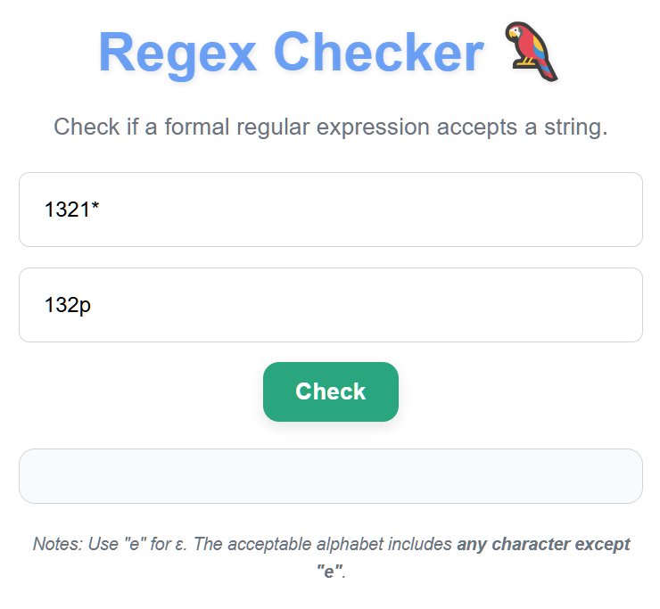
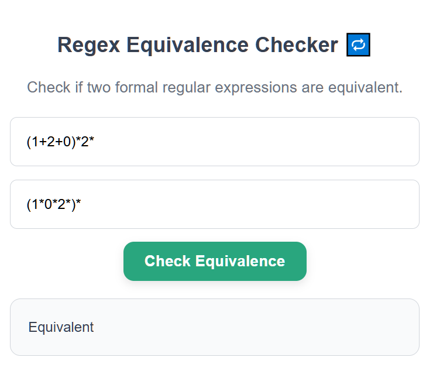
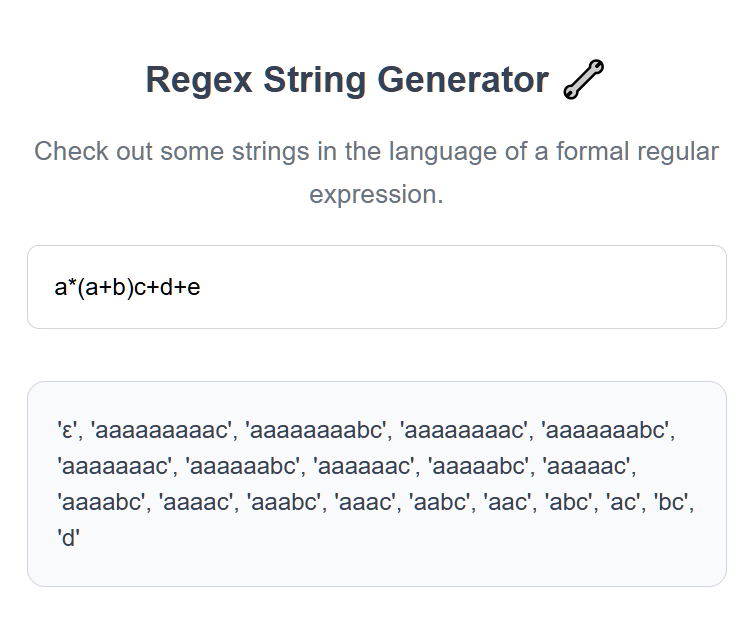

# Formal-Regular-Expressions 🦜

Formal-Regular-Expressions is a python-based application that parses formal regexes, displaying some of the strings that the regular expression accepts, if any given string is accepted by the regular expression, and if two regular expressions are equivalent.

## Website

All functionality on the website: https://ronit127.github.io/formal-regular-expressions/

## How it Works

  

**Checks if any regex (on top) matches a user-inputted string. This is done by converting the regex into an NFA and then simulating the string on the NFA**

  

**Checks if any two regex are equivalent - that is, they describe the same languages. This is done with the following steps:**
1. using Thompson's construction algorithm to convert the two regexes into NFAs
2. using powerset construction to convert the two NFAs into corresponding DFAs, **D_1** and **D_2**
3. checking DFA equivalence: Creating a product construction of **D_1** and **D_2** - let's call **D**.
4. using a depth-first search on **D** to check if a path exists from the start state to any state such that **D_1** is accepting and **D_2** is rejecting or vice versa. If there is, then return *FALSE*. *TRUE* otherwise.

  

**Displays some of the strings in the language described by some regex. This is done by accumulating a list of *accepted* strings when simulating the regex's corresponding NFA**

## Contributing

Any pull requests or suggestions are welcome. If there are any serious bugs, open an issue!

## License

[MIT](https://choosealicense.com/licenses/mit/)
